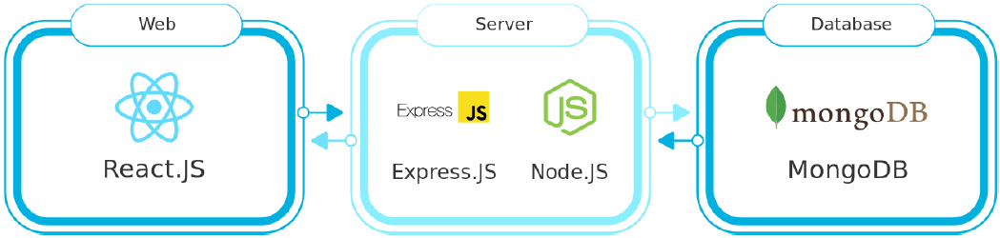

# [MergeMe](https://mergeme.herokuapp.com/) | Social Media Platform

<p align="center">
  
</p>

</br>

**MergeMe** is a **Social Media Platform** with main purpose to **Merge** people around the globe.**MergeMe** is a social media platform where people can communicate with each other in real-time, create and share posts, and create networks such as group chats with each other. **MergeMe** is appealing because it is simple to use without any unnecessary features and thus make it straightforward for the users to **Merge** with each other. Moreover, the proposed software is special because it implements a real-time chat feature that enables users to chat inside the web application without the need to download any external software such as a messenger.

## Three-Tier Architecture



## Tech Stack


## Running Development Server

```bash
# Step 1: Clone this repository.
git clone https://github.com/GeorgiosIoannouCoder/mergeme.git
# Step 2: Install packages.
npm i
# Step 3: Run the development server.
npm run dev
# Step 4: Open http://localhost:3000 with your browser and enjoy the application.
```
